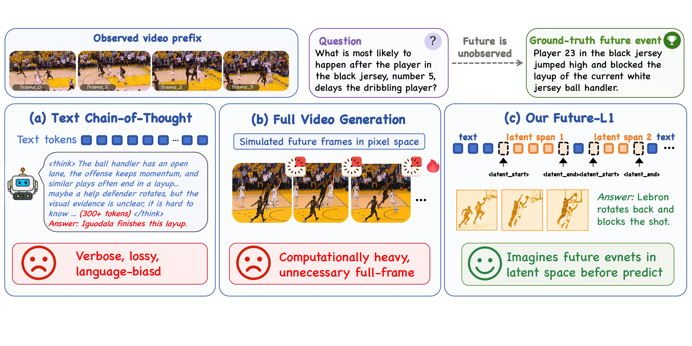
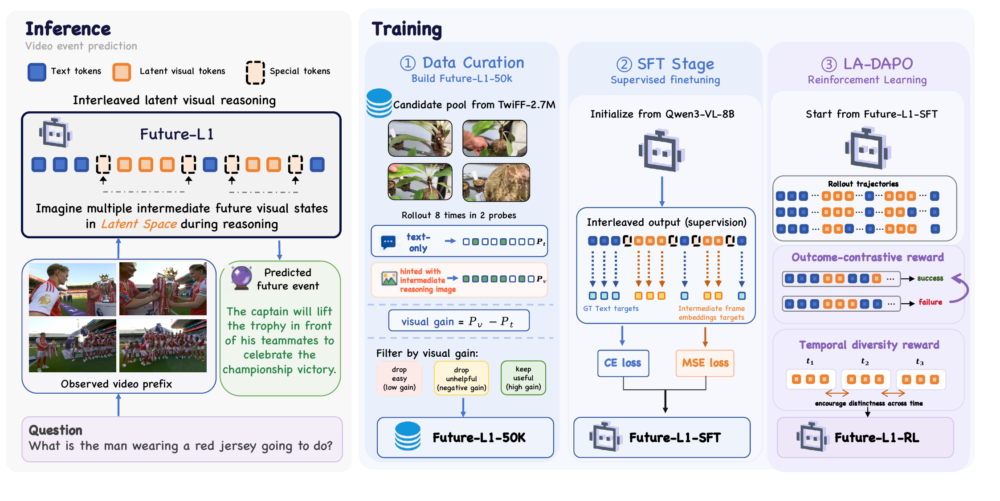

<h1 align="center">💭 Imagine Before You Predict</h1>
<h3 align="center">Interleaved Latent Visual Reasoning for Video Event Prediction</h3>

<p align="center">
  <a href="#"></a>
</p>

<p align="center">
  <a href="#highlights"><b>Highlights</b></a> •
  <a href="#getting-started"><b>Getting Started</b></a> •
  <a href="#results"><b>Results</b></a> •
  <a href="#acknowledgements"><b>Acknowledgements</b></a> •
  <a href="#citation"><b>Citation</b></a>
</p>

<p align="center">
  <b>Future-L1</b> teaches multimodal LLMs to alternate between language tokens and continuous latent visual spans, enabling compact future-state imagination before answering video event prediction questions.
</p>

<p align="center">
  
</p>
<p align="center"><em><b>Figure 1.</b> Text-CoT can be verbose and visually lossy, while pixel-space future simulation is computationally heavy. Future-L1 inserts compact latent visual spans that preserve dynamic future semantics without generating full frames.</em></p>

---

## ✨ Highlights

- **Interleaved latent visual reasoning.** Future-L1 alternates between `<reason>` text and bounded `<|latent_start|>…<|latent_end|>` spans during autoregressive decoding, keeping dynamic visual structure in a continuous channel instead of verbalizing every intermediate hypothesis.
- **Future-L1-50K.** We curate 50K high-utility examples from TwiFF-style trajectories by **visual-gain selection**: retain samples where intermediate future visual hints measurably improve prediction over a text-only baseline.
- **LA-DAPO RL.** A latent-aware extension of DAPO with **outcome-contrastive** (`R_ctr`) and **temporal-diversity** (`R_div`) rewards that optimize sampled latent trajectories without intermediate-frame annotations at RL time.
- **State-of-the-art VEP performance.** Future-L1-RL reaches **85.4%** on FutureBench and **3.04** average score on TwiFF-Bench, with especially strong gains on multi-hop and non-consecutive future-event splits.
- **Compact inference.** Accuracy improves through latent visual computation rather than long text-only chains or multi-turn search.

<p align="center">
  
</p>
<p align="center"><em><b>Figure 2.</b> (Left) Future-L1-50K is built by ranking TwiFF candidates by visual gain <i>p<sub>v</sub> − p<sub>t</sub></i>. (Center) SFT trains interleaved text–latent trajectories, aligning latent spans with future visual states. (Right) LA-DAPO further optimizes sampled trajectories with outcome-contrastive and temporal-diversity rewards.</em></p>

---

## 🚀 Getting Started

```bash
# Install
pip install -r requirements_sft.txt
pip install -r requirements_rl.txt
cd RL_v2 && pip install -e . && cd ..
cd lmms-eval && pip install -e . && cd ..

# Replace chat_template.json before training (once on the base Qwen3-VL checkpoint)
cp chat_template.json /path/to/Qwen3-VL-8B-Instruct/chat_template.json

# SFT
bash scripts/train.sh          # Future-L1 format
bash scripts/train_twiff.sh    # TwiFF-style mixed dataset

# RL (LA-DAPO)
cd RL_v2
MODEL_PATH=/path/to/Future-L1-SFT TRAIN_FILES=/path/to/RL_20K.json bash train.sh depo

# Evaluation
cd lmms-eval
bash examples/eval_futurebench_future_l1.sh
bash examples/eval_twiffbench_future_l1.sh
```

Set `MODEL_PATH`, `DATA_PATH`, `TRAIN_FILES`, and `OUTPUT_DIR` in the launch scripts before running.

---

## 📊 Results

| | FutureBench (Acc.) | TwiFF-Bench (Avg.) |
|---|---:|---:|
| Qwen3-VL-8B (zero-shot) | 61.0 | 2.44 |
| Text-only SFT on Future-L1-50K | 65.0 | — |
| **Future-L1-SFT** | **73.2** | 2.52 |
| **Future-L1-RL (LA-DAPO)** | **85.4** | **3.04** |

> **+24.4** points on FutureBench over the Qwen3-VL-8B backbone · **+10.4** over the previous best Video-CoE · **+0.60** average score on TwiFF-Bench

---

## 🙏 Acknowledgements

We gratefully acknowledge the contributions of the open-source community, particularly:

- [Qwen-VL-Series-Finetune](https://github.com/2U1/Qwen-VL-Series-Finetune)
- [Latent Visual Reasoning (LVR)](https://github.com/VincentLeebang/lvr)
- [SwimBird](https://github.com/Accio-Lab/SwimBird)
- [EasyR1](https://github.com/hiyouga/easyr1)
- [LaViT](https://github.com/Svardfox/LaViT) — Aligning latent visual thoughts for multi-modal reasoning via teacher-extracted visual thought trajectories.

---

## 📖 Citation

```bibtex
@article{tbd,
  title   = {TBD},
  author  = {TBD},
  year    = {TBD}
}
```

Citation will be updated upon publication.
