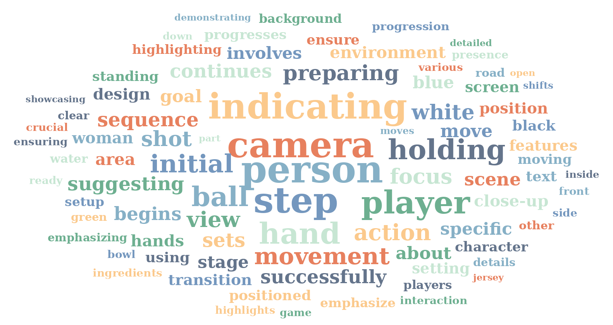
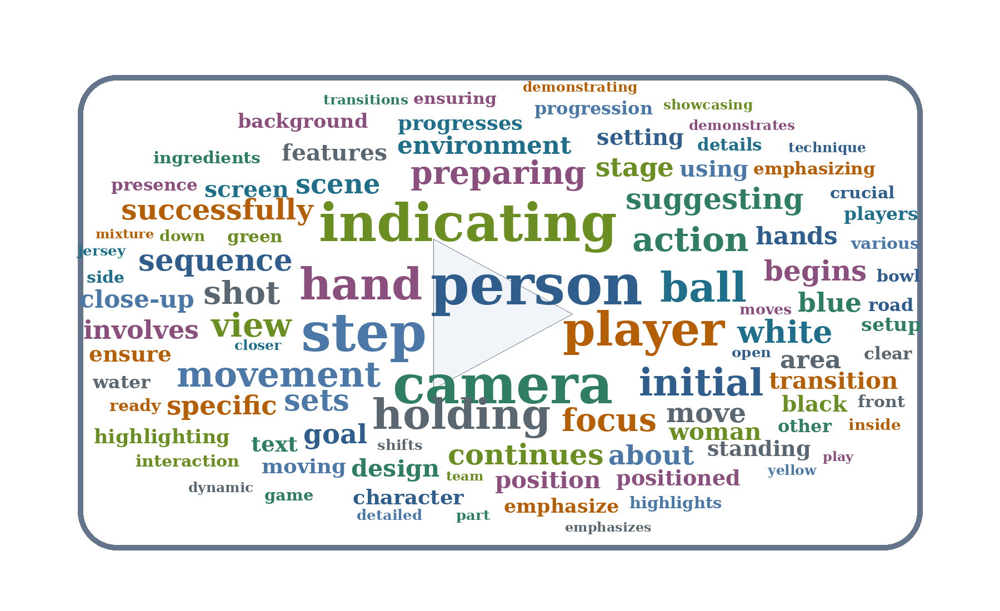
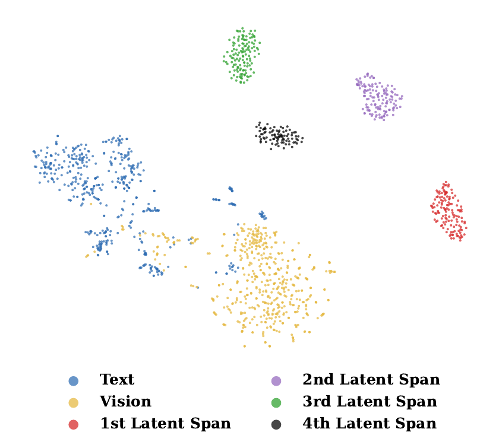
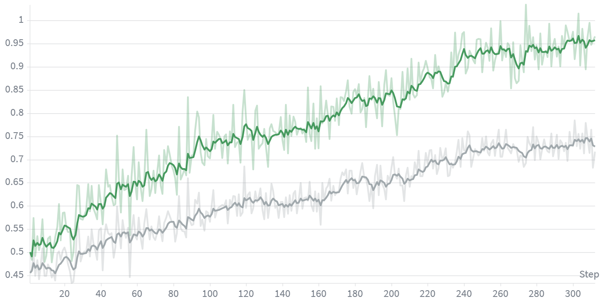
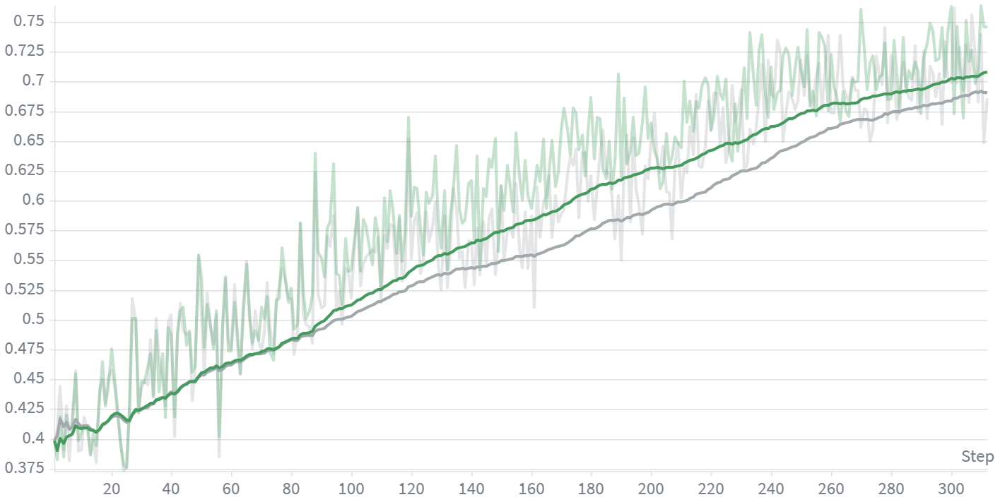
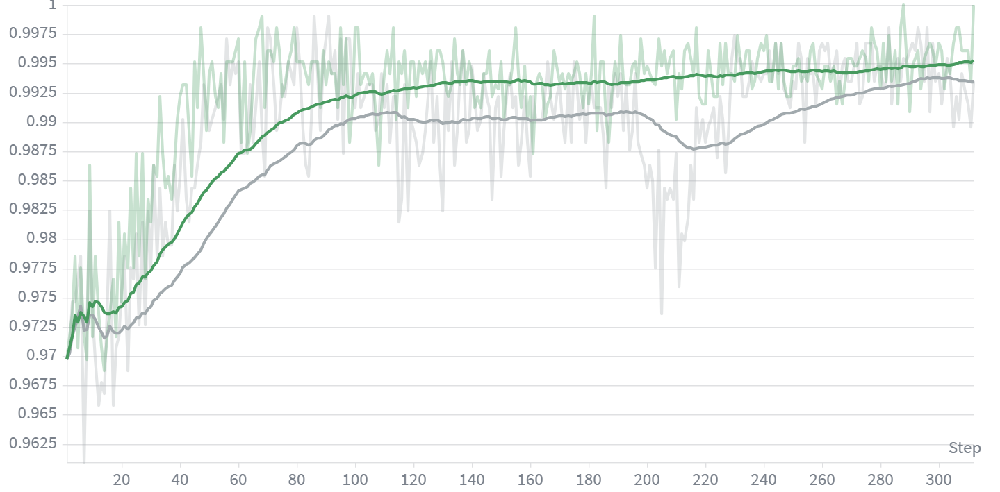
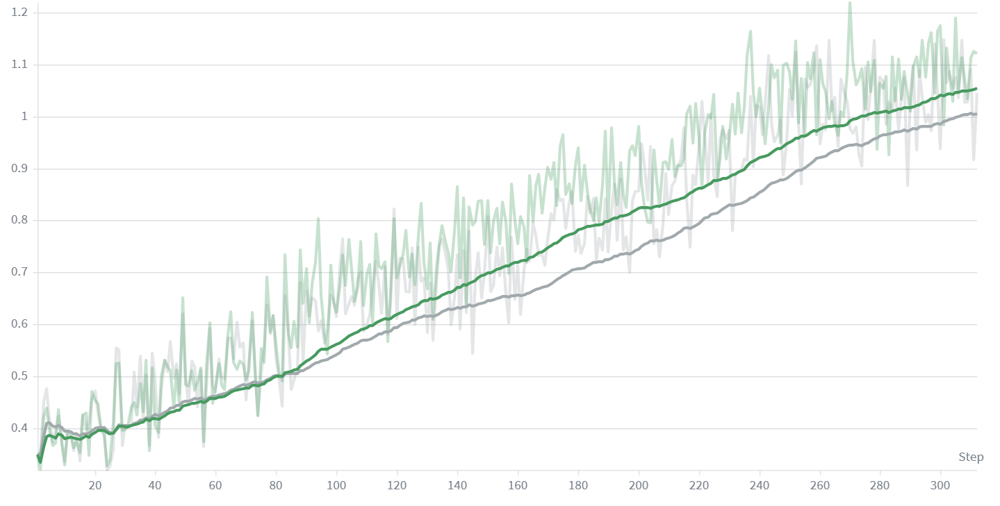
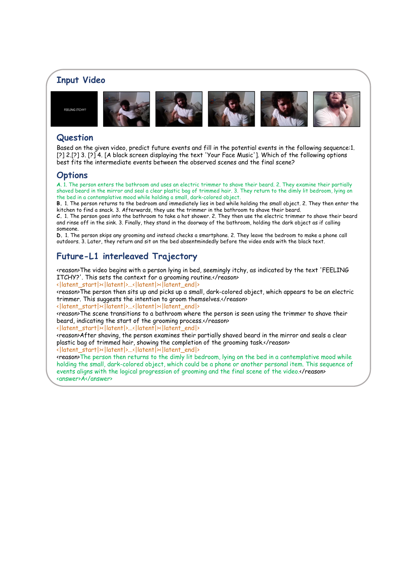
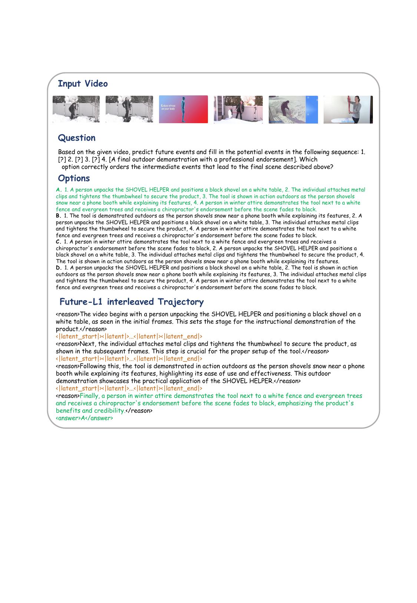

<h1 align="center">Imagine Before You Predict</h1>
<h3 align="center">Interleaved Latent Visual Reasoning for Video Event Prediction</h3>

<p align="center">
  <a href="#-highlights"><b>Highlights</b></a> •
  <a href="#-method"><b>Method</b></a> •
  <a href="#-results"><b>Results</b></a> •
  <a href="#-analysis"><b>Analysis</b></a> •
  <a href="#-getting-started"><b>Getting Started</b></a> •
  <a href="#-acknowledgements"><b>Acknowledgements</b></a> •
  <a href="#-related-work"><b>Related Work</b></a> •
  <a href="#-citation"><b>Citation</b></a>
</p>

<p align="center">
  <b>Future-L1</b> teaches multimodal LLMs to alternate between language tokens and continuous latent visual spans, enabling compact future-state imagination before answering video event prediction questions.
</p>

<p align="center">
  
</p>
<p align="center"><em><b>Figure 1.</b> Text-CoT can be verbose and visually lossy, while pixel-space future simulation is computationally heavy. Future-L1 inserts compact latent visual spans that preserve dynamic future semantics without generating full frames.</em></p>

---

## TL;DR

| | FutureBench (Acc.) | TwiFF-Bench (Avg.) |
|---|---:|---:|
| Qwen3-VL-8B (zero-shot) | 61.0 | 2.44 |
| Text-only SFT on Future-L1-50K | 65.0 | — |
| **Future-L1-SFT** | **73.2** | 2.52 |
| **Future-L1-RL (LA-DAPO)** | **85.4** | **3.04** |

> **+24.4** points on FutureBench over the Qwen3-VL-8B backbone · **+10.4** over the previous best Video-CoE · **+0.60** average score on TwiFF-Bench

---

## Highlights

- **Interleaved latent visual reasoning.** Future-L1 alternates between `<reason>` text and bounded `<|latent_start|>…<|latent_end|>` spans during autoregressive decoding, keeping dynamic visual structure in a continuous channel instead of verbalizing every intermediate hypothesis.
- **Future-L1-50K.** We curate 50K high-utility examples from TwiFF-style trajectories by **visual-gain selection**: retain samples where intermediate future visual hints measurably improve prediction over a text-only baseline.
- **LA-DAPO RL.** A latent-aware extension of DAPO with **outcome-contrastive** (`R_ctr`) and **temporal-diversity** (`R_div`) rewards that optimize sampled latent trajectories without intermediate-frame annotations at RL time.
- **State-of-the-art VEP performance.** Future-L1-RL reaches **85.4%** on FutureBench and **3.04** average score on TwiFF-Bench, with especially strong gains on multi-hop and non-consecutive future-event splits.
- **Compact inference.** Accuracy improves through latent visual computation rather than long text-only chains or multi-turn search.

---

## Method

<p align="center">
  
</p>
<p align="center"><em><b>Figure 2.</b> (Left) Future-L1-50K is built by ranking TwiFF candidates by visual gain <i>p<sub>v</sub> − p<sub>t</sub></i>. (Center) SFT trains interleaved text–latent trajectories, aligning latent spans with future visual states. (Right) LA-DAPO further optimizes sampled trajectories with outcome-contrastive and temporal-diversity rewards.</em></p>

### Interleaved decoding

Given an observed video prefix and a forecasting question, Future-L1 generates responses as interleaved trajectories:

```text
<reason> textual reasoning step 0 </reason>
<|latent_start|> <|latent|> ... <|latent|> <|latent_end|>
<reason> textual reasoning step 1 </reason>
...
<answer> predicted future event </answer>
```

Three special tokens control the latent channel:

| Token | Role |
|---|---|
| `<\|latent_start\|>` | Enter latent visual reasoning mode |
| `<\|latent\|>` | Emit a continuous latent thought fed back as the next input embedding |
| `<\|latent_end\|>` | Return to textual reasoning |

### Stage 1: Visual-gain SFT

Future-L1-50K is selected from TwiFF-style visual chain-of-thought data. For each candidate, the backbone is evaluated under:

- **Text-only:** observed prefix + question
- **Visual-hint:** prefix + question + intermediate future reasoning frames

Samples are retained when text-only accuracy is not saturated and the visual hint provides a measurable lift. SFT combines next-token prediction with latent MSE alignment:

```text
L_SFT = L_CE + λ · L_Latent
```

where latent positions are aligned to Qwen3-VL vision-encoder embeddings of the corresponding future reasoning frames.

<p align="center">
  
  &nbsp;
  
</p>
<p align="center"><em><b>Figure 3.</b> Topic distribution of curated Future-L1-50K samples.</em></p>

### Stage 2: LA-DAPO RL

SFT provides a grounded initialization, but teacher-forced latents are not directly optimized for sampled prediction success. **LA-DAPO** (Latent-Aware Direct Advantage Policy Optimization) keeps DAPO's answer and format rewards and adds two trajectory-level latent terms:

```text
R = λ_a · R_acc + λ_f · R_fmt + λ_c · R_ctr + λ_d · R_div
```

| Reward | Meaning |
|---|---|
| `R_acc` | Final-answer correctness (rule-based + LLM-judge fallback) |
| `R_fmt` | Valid interleaved `<reason>` / latent / `<answer>` format |
| `R_ctr` | Outcome-contrastive latent reward: pull correct trajectories together, treat incorrect rollouts as negatives |
| `R_div` | Temporal-diversity reward: discourage adjacent latent spans from collapsing to the same visual thought |

Paper defaults: `λ_a=0.9`, `λ_f=0.1`, `λ_c=0.2`, `λ_d=0.1`, contrastive temperature `τ=0.5`.

---

## Results

### FutureBench

Accuracy (%) on [FutureBench](https://github.com/OpenGVLab/FutureBench). Future-L1 is built on **Qwen3-VL-8B-Instruct** and uses **32 input frames** at evaluation.

| Model | Size | Training | 1-Hop | 2-Hop | 3-Hop | Interp. | Avg. |
|---|---:|---|---:|---:|---:|---:|---:|
| GPT-4o | — | Zero-shot | 61.9 | 61.7 | 72.1 | 51.6 | 59.0 |
| Qwen3-VL | 30B-A3B | Zero-shot | 65.3 | 70.5 | 76.1 | 62.2 | 66.9 |
| Video-o3 | 7B | SFT+RL | 68.2 | 73.6 | 63.2 | 69.7 | 68.9 |
| Video-CoE | 7B | SFT+RL | 80.9 | 83.9 | 71.6 | 71.4 | 75.0 |
| Qwen3-VL-Instruct | 8B | Zero-shot | 64.2 | 65.8 | 66.2 | 55.8 | 61.0 |
| Text-only SFT on Future-L1-50K | 8B | SFT | 67.6 | 66.8 | 68.2 | 62.0 | 65.0 |
| **Future-L1-SFT** | 8B | SFT | 70.5 | 73.1 | 77.6 | 72.2 | **73.2** |
| **Future-L1-RL** | 8B | SFT+RL | **83.2** | **86.5** | **86.6** | **85.1** | **85.4** |

### TwiFF-Bench

[TwiFF-Bench](https://github.com/TwiFF-Project/TwiFF) evaluates both reasoning trajectory quality and final answer quality on a 0–5 scale.

| Model | Size | CoT | Answer | Avg. |
|---|---:|---:|---:|---:|
| Qwen2.5-VL | 7B | 2.46 | 1.63 | 2.05 |
| TwiFF-300K | 7B | 2.90 | 2.55 | 2.73 |
| TwiFF-2.7M | 7B | 2.95 | 2.62 | 2.79 |
| Qwen3-VL-Instruct | 8B | 2.75 | 2.14 | 2.44 |
| **Future-L1-SFT** | 8B | 2.62 | 2.42 | 2.52 |
| **Future-L1-RL** | 8B | **3.11** | **2.97** | **3.04** |

---

## Analysis

<p align="center">
  
</p>
<p align="center"><em><b>Figure 4.</b> t-SNE of Future-L1-RL latent embeddings on FutureBench; sequential latent spans form distinct clusters.</em></p>

<p align="center">
  
  
  
  
</p>
<p align="center"><em><b>Figure 5.</b> Reward dynamics during RL. Future-L1 shows higher and more stable rewards than DAPO.</em></p>

<p align="center">
  
  &nbsp;
  
</p>
<p align="center"><em><b>Figure 6.</b> Left: latent-span usage by reasoning depth. Right: LA-DAPO benefits monotonically from more visual-gain RL data (5K → 20K).</em></p>

### Qualitative examples

<p align="center">
  
  
  
</p>
<p align="center"><em><b>Figure 7.</b> Future-L1 imagines intermediate latent visual states that support correct multi-step future prediction.</em></p>

### Ablation snapshot

| Study | Best setting | Finding |
|---|---|---|
| Latent MSE weight | `λ=0.1` | Explicit but not dominant latent supervision works best |
| Maximum latent budget | `L_max=4` | Short supervised spans outperform long latent spans |
| RL objective | LA-DAPO | Latent-aware rewards improve over GRPO, DePO, and DAPO |
| RL data scale | 20K | LA-DAPO benefits monotonically from more visual-gain data |

---

## Repository Structure

```text
Future-L1/
├── asset/                      # Paper figures for README / project page
├── src/
│   ├── train/                  # SFT training entry point
│   ├── dataset/                # Future-L1 / TwiFF / mixed SFT datasets
│   ├── model/                  # Future-L1 model wrapper and latent decoding
│   └── trainer/                # FutureL1SFTTrainer
├── scripts/                    # SFT launch scripts (train.sh, train_twiff.sh)
├── RL_v2/                      # EasyR1-based GRPO / DAPO / DePO / LA-DAPO RL
├── lmms-eval/                  # Evaluation fork with Future-L1 adapters
├── prompts/                    # System prompts for interleaved reasoning
├── requirements_sft.txt
└── requirements_rl.txt
```

---

## Getting Started

### Installation

Paper experiments use **8× NVIDIA H200 GPUs**, **bf16** training, and **Qwen3-VL-8B-Instruct** as the backbone.

```bash
# SFT
pip install -r requirements_sft.txt

# RL
pip install -r requirements_rl.txt
cd RL_v2 && pip install -e . && cd ..

# Evaluation
cd lmms-eval && pip install -e . && cd ..
```

### SFT Training

Main entry point: `src/train/train.py`

```bash
# Future-L1 format
bash scripts/train.sh

# TwiFF-style mixed dataset
bash scripts/train_twiff.sh
```

Representative command:

```bash
torchrun --nproc_per_node 8 --master_port 29502 src/train/train.py \
  --deepspeed scripts/zero2.json \
  --model_id /path/to/Qwen3-VL-8B-Instruct \
  --data_path /path/to/Future-L1-50K.json \
  --output_dir /path/to/output/Future-L1-SFT \
  --latent_loss mse \
  --latent_lambda 0.1 \
  --max_latent_token 4 \
  --freeze_vision_tower True \
  --freeze_merger True \
  --freeze_llm False \
  --learning_rate 1e-5 \
  --bf16 True \
  --lazy_preprocess True \
  --use_mixed_dataset True
```

| Hyperparameter | Value |
|---|---:|
| Backbone | Qwen3-VL-8B-Instruct |
| Trainable modules | LLM (vision tower + merger frozen) |
| Precision / engine | bf16 + DeepSpeed ZeRO-2 |
| Global batch size | 128 |
| Peak LR | 1e-5 |
| Latent MSE weight `λ` | 0.1 |
| Max latent budget | 4 |

### RL Training (LA-DAPO)

RL code lives in `RL_v2/`. Config: `RL_v2/examples/config_future_l1.yaml`.

```bash
cd RL_v2

# DAPO baseline (latent-aware rollout + vMF log-prob)
MODEL_PATH=/path/to/Future-L1-SFT \
TRAIN_FILES=/path/to/RL_20K.json \
bash train.sh dapo

# DePO (decoupled token/latent PPO + closed-form vMF KL)
bash train.sh depo

# Full LA-DAPO with paper reward weights
MODEL_PATH=/path/to/Future-L1-SFT \
TRAIN_FILES=/path/to/RL_20K.json \
FUTURE_L1_LATENT_CTR_LAMBDA=0.2 \
FUTURE_L1_LATENT_DIV_LAMBDA=0.1 \
FUTURE_L1_LATENT_CTR_TEMPERATURE=0.5 \
bash train.sh depo
```

Supported modes: `grpo`, `dapo`, `depo`, and `grpo_ctr` / `dapo_ctr` / `depo_ctr` (base mode + outcome-contrastive `R_ctr`).

| Hyperparameter | Value |
|---|---:|
| Rollout batch / group size | 64 / 8 |
| Max prompt / response length | 8192 / 2048 |
| Sampling | temperature 0.9, top-p 0.99 |
| DAPO clip | ε_l=0.2, ε_h=0.28 |
| Online group filter | mean accuracy ∈ [0.1, 0.9] |
| `λ_c` / `λ_d` / `τ` | 0.2 / 0.1 / 0.5 |

### Evaluation

Future-L1 evaluation is integrated into the local `lmms-eval/` fork via the `future_l1` model wrapper.

**FutureBench** (32 frames, greedy decoding):

```bash
cd lmms-eval
export ROT_CODE_ROOT=/path/to/Future-L1

accelerate launch --num_processes 8 --main_process_port 12345 -m lmms_eval \
  --model future_l1 \
  --model_args pretrained=/path/to/Future-L1-RL,code_root=${ROT_CODE_ROOT},attn_implementation=flash_attention_2,max_num_frames=32 \
  --tasks futurebench_future_l1 \
  --batch_size 1 \
  --gen_kwargs max_new_tokens=2048,temperature=0,top_p=1,do_sample=false \
  --output_path ./logs_futurebench_future_l1/

# or
bash examples/eval_futurebench_future_l1.sh
```

**TwiFF-Bench** (8 frames, greedy decoding):

```bash
bash examples/eval_twiffbench_future_l1.sh
```

---

## Data Format

SFT examples are JSON objects with multimodal conversations and optional future reasoning images:

```json
{
  "conversations": [
    {"from": "human", "value": "Question ... <video>"},
    {"from": "gpt", "value": "<reason> ... </reason> <|latent_start|> ... <|latent_end|> ... <answer> ... </answer>"}
  ],
  "video": ["path/to/video.mp4"],
  "reasoning_image": ["path/to/future_reasoning_frame.png"],
  "answer": "final answer"
}
```

Relative media paths are resolved against the JSON file location.

---

## Practical Notes

- Replace cluster-specific paths (`MODEL_PATH`, `DATA_PATH`, `TRAIN_FILES`, `OUTPUT_DIR`) before running on a new machine.
- Use different `MASTER_PORT` / `main_process_port` values when launching multiple jobs on one node.
- For reproducible evaluation, use `temperature=0`, `top_p=1`, `do_sample=false` in lmms-eval.
- RL requires Future-L1 special tokens in the checkpoint; the launcher auto-detects `<|latent_start|>`, `<|latent|>`, `<|latent_end|>` from the tokenizer.

---

## Acknowledgements

We gratefully acknowledge the contributions of the open-source community, particularly:

- [**Qwen-VL-Series-Finetune**](https://github.com/2U1/Qwen-VL-Series-Finetune) — SFT training infrastructure for Qwen-VL / Qwen2-VL / Qwen2.5-VL / Qwen3-VL models.
- [**Latent Visual Reasoning (LVR)**](https://github.com/VincentLeebang/lvr) — latent visual reasoning formulation and training recipes that informed our continuous latent-span design.
- [**SwimBird**](https://github.com/Accio-Lab/SwimBird) — hybrid autoregressive MLLM with switchable text / vision / interleaved reasoning modes; our SFT codebase builds on this design.
- [**EasyR1**](https://github.com/hiyouga/easyr1) — efficient multi-modality RL training framework; our `RL_v2/` pipeline is built on top of EasyR1 / veRL.

---

## Citation

If you find Future-L1 useful, please cite:

```bibtex
@article{futurel1,
  title   = {Imagine Before You Predict: Interleaved Latent Visual Reasoning for Video Event Prediction},
  author  = {Anonymous},
  journal = {EMNLP},
  year    = {2026}
}
```

---

## License

This repository follows the license in `LICENSE`. Third-party datasets, benchmarks, base models, and evaluation frameworks should be used under their respective licenses and terms.

---

## Related Work

- [**LaViT**](https://github.com/Svardfox/LaViT) — *Aligning Latent Visual Thoughts for Multi-modal Reasoning* ([arXiv:2601.10129](https://arxiv.org/abs/2601.10129)). LaViT supervises visual thought trajectories extracted from a teacher model to train efficient student MLLMs with `<lvr>` latent tokens, complementing our interleaved latent-span design for video event prediction.
